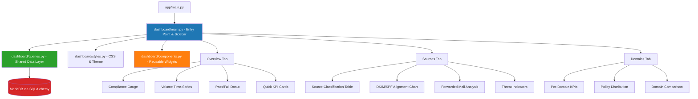
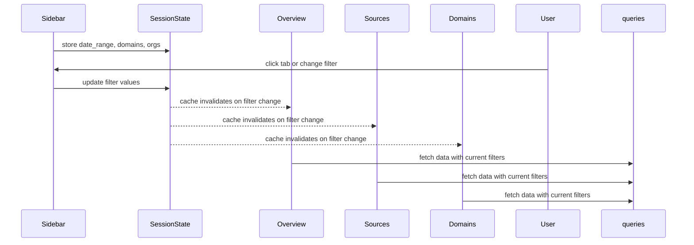

# DMARClyzer Dashboard Redesign — Implementation Plan

## Goal
Transform the current single-page Streamlit dashboard into a **dmarcian.com-like** experience with a multi-tab layout (Overview / Sources / Domains), Plotly interactive charts, and a modular package structure.

---

## Architecture Overview



---

## New File Structure

```
app/
├── __init__.py
├── main.py                  (updated: points to dashboard.main)
├── models.py                (unchanged)
├── parser.py                (unchanged)
├── fetcher.py               (unchanged)
├── auth.py                  (unchanged)
├── dashboard.py             (DEPRECATED: replaced by package)
└── dashboard/               (NEW PACKAGE)
    ├── __init__.py
    ├── main.py              (entry: sidebar, tabs, session state)
    ├── queries.py           (all SQL/data fetching functions)
    ├── components.py        (reusable Plotly/HTML widgets)
    ├── styles.py            (CSS, color constants, theming)
    ├── overview.py          (Overview tab)
    ├── sources.py           (Sources tab)
    └── domains.py           (Domains tab)
```

---

## New Dependency

| Package | Version | Purpose |
|---------|---------|---------|
| `plotly` | `>=5.18.0` | Interactive charts: gauges, donuts, bar charts, heatmaps |

Update `requirements.txt`:
```
plotly>=5.18.0
```

---

## Tab-by-Tab Design

### Sidebar (shared across all tabs)

- **Date Range Picker** — same as current
- **Domain Multi-select** — same as current
- **Organization Multi-select** — same as current
- **DMARC Disposition Filter** — new: filter by pass/fail/quarantine/reject
- **Refresh Button** — new: manual data refresh

All filters stored in `st.session_state` and shared across tabs.

---

### Tab 1: Overview (`dashboard/overview.py`)

Layout:
```
┌─────────────────────────────────────────────────────┐
│  [Compliance Gauge]   [Total Volume]   [Pass Rate]  │  3-column KPI row
│  (Plotly indicator)   (Big Number)     (Big Number) │
├─────────────────────────────────────────────────────┤
│  [Volume Over Time — Plotly Area Chart]              │  full width
│  with disposition stacking (pass/quarantine/reject)  │
├──────────────────────────┬──────────────────────────┤
│  [DMARC Disposition      │  [DKIM vs SPF Alignment  │  2-column
│   Donut/Pie Chart]       │   Grouped Bar Chart]     │
├──────────────────────────┴──────────────────────────┤
│  [Policy Adoption — Stacked Bar: p=none/quarantine/ │  full width
│   reject distribution across domains]                │
├─────────────────────────────────────────────────────┤
│  [Recent Reports Summary — compact table, last 10]   │  full width
└─────────────────────────────────────────────────────┘
```

**Charts:**
- `plotly.graph_objects.Indicator` for compliance gauge (0-100%)
- `plotly.express.area` for time-series volume by disposition
- `plotly.express.pie` for disposition distribution
- `plotly.express.bar` for DKIM/SPF alignment comparison
- `plotly.express.bar` (stacked) for policy adoption

**Data Queries:**
- Global aggregate: total messages, pass/fail count, compliant %
- Daily volume grouped by disposition
- Disposition distribution (count sum per disposition type)
- DKIM pass/fail count vs SPF pass/fail count
- Policy distribution: count of reports per `p` value per domain

---

### Tab 2: Sources (`dashboard/sources.py`)

This is the core dmarcian-like feature — **Source Classification**.

Layout:
```
┌─────────────────────────────────────────────────────┐
│  [Threats/Unknown]  [Forwarded]  [Failing]  [Pass]  │  4 metric cards
│  (red)              (yellow)     (orange)   (green) │
├─────────────────────────────────────────────────────┤
│  Source Classification Breakdown                    │
│  ┌───────────────────────────────────────────────┐  │
│  │ IP Address │ Hostname │ Volume │ Category     │  │
│  │            │          │        │ (colored tag)│  │
│  │ 1.2.3.4   │ mx.a.com │ 50,000 │ ✅ Compliant │  │
│  │ 5.6.7.8   │ mail.b   │ 12,000 │ ⚠️ Forwarded │  │
│  │ 9.0.1.2   │ spam.c   │  5,000 │ ❌ Failing   │  │
│  │ ...        │          │        │              │  │
│  └───────────────────────────────────────────────┘  │
├──────────────────────────┬──────────────────────────┤
│  [Top 10 Sending IPs     │  [DKIM Alignment by      │
│   Horizontal Bar Chart]  │   Source — Heatmap]      │
├──────────────────────────┴──────────────────────────┤
│  [Forwarded Email Analysis — which forwarders are   │
│   rewriting headers, causing SPF breaks]             │
└─────────────────────────────────────────────────────┘
```

**Source Classification Logic:**
| Category | Condition | Color |
|----------|-----------|-------|
| **Compliant** | DMARC result = pass (both DKIM+SPF aligned) | Green |
| **Forwarded** | SPF fail/softfail BUT DKIM pass (typical of mailing lists/forwarders) | Yellow/Amber |
| **Failing** | DKIM fail, regardless of SPF | Orange |
| **Threat/Unknown** | Both SPF and DKIM fail, no alignment | Red |

**Charts:**
- `plotly.express.bar` (horizontal) for top 10 sending IPs by volume
- Custom colored badges in the dataframe for source categories
- `plotly.express.density_heatmap` or grouped bar for DKIM/SPF alignment matrix

**Data Queries:**
- Aggregated IP-level data with DKIM/SPF alignment and disposition
- Top N IPs by message count
- Forwarded email detection: SPF fail + DKIM pass
- DKIM/SPF alignment matrix (pass/pass, pass/fail, fail/pass, fail/fail)

---

### Tab 3: Domains (`dashboard/domains.py`)

Layout:
```
┌─────────────────────────────────────────────────────┐
│  [Domain 1 Card]  [Domain 2 Card]  [Domain 3 Card]  │  scrollable row
│  ┌──────────────┐ ┌──────────────┐ ┌──────────────┐ │
│  │ example.com  │ │ other.com    │ │ third.com    │ │
│  │ Vol: 1.2M    │ │ Vol: 500K    │ │ Vol: 100K    │ │
│  │ Pass: 95% ✅ │ │ Pass: 72% ⚠️ │ │ Pass: 45% ❌ │ │
│  │ p=reject     │ │ p=quarantine │ │ p=none       │ │
│  └──────────────┘ └──────────────┘ └──────────────┘ │
├─────────────────────────────────────────────────────┤
│  Domain Comparison Table                             │
│  ┌───────────────────────────────────────────────┐  │
│  │ Domain     │ Volume │ Pass% │ DKIM% │ SPF%   │  │
│  │            │        │       │ OK    │ OK     │  │
│  │ example..  │ 1.2M   │ 95%   │ 97%   │ 93%    │  │
│  │ other..    │ 500K   │ 72%   │ 85%   │ 68%    │  │
│  └───────────────────────────────────────────────┘  │
├─────────────────────────────────────────────────────┤
│  [Policy Distribution by Domain — Grouped Bar]       │
│  showing p=none vs quarantine vs reject per domain   │
├─────────────────────────────────────────────────────┤
│  [DMARC Policy Adoption Timeline — Line Chart]       │
│  showing policy changes over time                    │
└─────────────────────────────────────────────────────┘
```

**Charts:**
- `plotly.express.bar` (grouped) for policy distribution per domain
- `plotly.express.line` for policy adoption over time
- Custom metric cards using HTML/CSS (Streamlit `st.markdown`)

**Data Queries:**
- Per-domain aggregates: total volume, pass rate, DKIM pass%, SPF pass%
- Policy distribution: count of reports by `p` value group by domain
- Policy timeline: `p` value changes over `begin_date` per domain
- Domain comparison table data

---

## Shared Data Layer (`dashboard/queries.py`)

All database access centralized here. Each function returns a `pd.DataFrame`:

| Function | Returns | Used By |
|----------|---------|---------|
| `fetch_filter_bounds()` | `(min_date, max_date, domains[], orgs[])` | Sidebar |
| `fetch_overview_metrics(start, end, domains, orgs)` | Aggregated KPIs dict | Overview |
| `fetch_volume_timeseries(start, end, domains, orgs)` | Daily volume by disposition | Overview |
| `fetch_disposition_distribution(start, end, domains, orgs)` | Count sum per disposition | Overview |
| `fetch_dkim_spf_alignment(start, end, domains, orgs)` | DKIM/SPF pass/fail counts | Overview, Sources |
| `fetch_policy_distribution(start, end, domains, orgs)` | Policy counts per domain | Overview, Domains |
| `fetch_source_classification(start, end, domains, orgs)` | IP-level with category | Sources |
| `fetch_forwarded_analysis(start, end, domains, orgs)` | Forwarder detection | Sources |
| `fetch_domain_metrics(start, end, domains, orgs)` | Per-domain aggregates | Domains |
| `fetch_policy_timeline(start, end, domains, orgs)` | Policy over time per domain | Domains |

All functions accept the same filter signature for consistency. Uses `st.cache_data` for caching.

---

## Reusable Components (`dashboard/components.py`)

| Component | Description |
|-----------|-------------|
| `metric_card(label, value, delta, color, icon)` | Styled HTML KPI card |
| `compliance_gauge(value, title)` | Plotly indicator gauge 0-100% |
| `source_badge(category)` | Color-coded HTML badge (Compliant/Forwarded/Failing/Threat) |
| `styled_dataframe(df, column_config)` | Streamlit dataframe with consistent styling |
| `loading_spinner(message)` | Wrapper for query loading states |
| `section_header(title, description)` | Consistent section header with optional help text |

---

## Styling (`dashboard/styles.py`)

```python
# Color constants matching dmarcian aesthetic
COLORS = {
    "pass": "#2ecc71",         # green
    "fail": "#e74c3c",         # red
    "quarantine": "#f39c12",   # orange
    "forwarded": "#f1c40f",    # yellow/amber
    "threat": "#c0392b",       # dark red
    "unknown": "#95a5a6",      # grey
    "primary": "#1f77b4",      # blue
    "background": "#f8f9fa",
}

# Global CSS to be injected
CUSTOM_CSS = """
    ... (dmarcian-like styling)
"""
```

---

## Filter Flow (Session State)



Filters are stored in `st.session_state` keys: `dash_date_range`, `dash_domains`, `dash_orgs`. All `@st.cache_data` functions use these as hash keys so they auto-invalidate.

---

## Migration Steps

1. Add `plotly` to `requirements.txt`
2. Create `app/dashboard/` directory
3. Create `__init__.py`, `styles.py`, `components.py`, `queries.py`
4. Create `overview.py`, `sources.py`, `domains.py`
5. Create `main.py` (entry point with tab logic)
6. Update `app/main.py`: change `"dashboard.py"` → `"dashboard/main.py"`
7. Update `Dockerfile`: ensure `COPY app /app` copies the new directory (already recursive)
8. Rename old `app/dashboard.py` → `app/dashboard.py.bak` (or remove)

---

## Database Considerations

All existing columns in `models.py` are sufficient — **no schema changes needed**. The new queries are purely analytical aggregations over existing data.

Key data points already available:
- `Record.disposition` → pass/fail categorization
- `Record.dkim`, `Record.spf` → alignment data
- `Record.source_ip`, `Record.host_name`, `Record.count` → source analysis
- `AuthResult.type`, `AuthResult.domain`, `AuthResult.result` → granular DKIM/SPF detail
- `Report.p`, `Report.sp`, `Report.pct` → policy distribution
- `Report.domain`, `Report.org_name` → grouping dimensions
- `Report.begin_date`, `Report.end_date` → time series

---

## Potential Enhancements (Future)

- Email forwarding detection via `AuthResult` DKIM domain mismatch with `header_from`
- IP reputation integration (external API like AbuseIPDB)
- Export to PDF/CSV for compliance reporting
- Alerting: email notifications when pass rate drops below threshold
- DMARC record validator (check if domain's DNS DMARC record is correctly configured)
